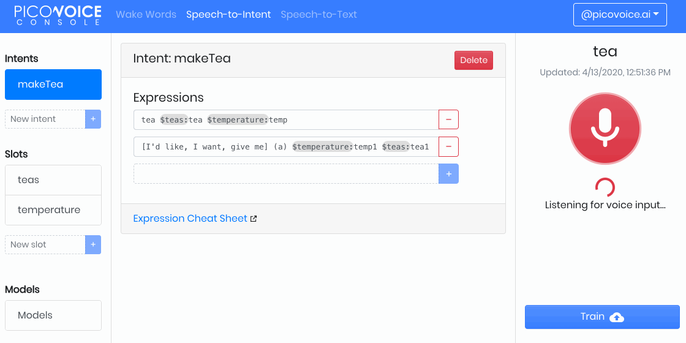

# Rhino

[](https://github.com/Picovoice/rhino/releases)

Made in Vancouver, Canada by [Picovoice](https://picovoice.ai)

Rhino is Picovoice's Speech-to-Intent engine. It directly infers intent from spoken commands within a given context of
interest, in real-time. For example, given a spoken command _"Can I have a small double-shot espresso with a lot of sugar
and some milk"_, Rhino infers that the user wants to order a drink with these specifications:

```json
{
  "type": "espresso",
  "size": "small",
  "numberOfShots": "2",
  "sugar": "a lot",
  "milk": "some"
}
```

Rhino is:

- using deep neural networks trained in real-world environments.
- compact and computationally-efficient, making it perfect for IoT.
- cross-platform. It is implemented in fixed-point ANSI C. Raspberry Pi (all variants), Beagle Bone, Android, iOS,
  Linux (x86_64), Mac (x86_64), Windows (x86_64), and web browsers are supported. Furthermore, Support for various ARM
  Cortex-A microprocessors and ARM Cortex-M microcontrollers is available for enterprise customers.
- self-service. Developers and UX designers can train custom models using [Picovoice Console](https://picovoice.ai/console/).

## Table of Contents

- [License](#license)
- [Use Cases](#use-cases)
- [Try It Out](#try-it-out)
- [Performance](#performance)
- [Model Variants](#model-variants)
- [Terminology](#terminology)
- [Picovoice Console](#picovoice-console)
- [Structure of Repository](#structure-of-repository)
- [Running Demo Applications](#running-demo-applications)
  - [Python](#python-demos)
  - [.NET](#net-demos)
  - [Java](#java-demos)
  - [Android](#android-demos)
  - [iOS](#ios-demos)
  - [JavaScript](#javascript-demos)
  - [C](#c-demos)
- [Integration](#integration)
  - [Python](#python)
  - [.NET](#net)
  - [Java](#java)
  - [Android](#android)
  - [iOS](#ios)
  - [JavaScript](#javascript)
  - [C](#c)
- [Releases](#releases)
- [FAQ](#faq)

## License

This repository is licensed under Apache 2.0 which allows running the engine on all supported platforms
(except microcontrollers) using a set of freely-available [models](/resources/contexts). You may create custom models
using [Picovoice Console](https://picovoice.ai/console/) for **non-commercial and personal use** free of charge. The
free-tier only allows model training for x86_64 (Linux, Mac, and Windows).

Custom models for other platforms are only provided with the purchase of the Picovoice enterprise license. To enquire
about the Picovoice development and commercial license terms and fees, [contact Picovoice](https://picovoice.ai/contact/).

## Use Cases

Rhino should be used when the domain of voice interactions is specific (limited). Smart appliances, hearables,
infotainment systems, and automotive are a few examples.

- If open-domain transcription is required (i.e. the user can say anything), check out
  [Leopard](https://github.com/Picovoice/leopard)
- If open-domain transcription with real-time feedback (incremental transcription results) is needed, check out
  [Cheetah](https://github.com/Picovoice/cheetah).
- If you need to recognize a few simple voice commands or activate a device using voice you should check out
  [Porcupine](https://github.com/Picovoice/porcupine).

## Try It Out

- [Interactive Web Demo](https://picovoice.ai/demos/barista/)

- [Picovoice Console (Rhino Editor)](https://picovoice.ai/console/)



- [Picovoice Console Rhino Tutorial](https://picovoice.ai/tutorials/designing-a-drive-thru-with-edge-voice-ai/)
- [Picovoice Console Rhino Video Tutorial](https://www.youtube.com/watch?v=npBaOx30QUs)

- Rhino and [Porcupine](https://github.com/Picovoice/porcupine) on an ARM Cortex-M4

[](https://www.youtube.com/watch?v=T0tAnh8tUQg)

## Performance

A comparison between the accuracy of Rhino and [Google's Dialogflow](https://dialogflow.com/) is provided
[here](https://github.com/Picovoice/speech-to-intent-benchmark). Across different noisy environments **Rhino is 96%
accurate while Dialogflow reaches 75% accuracy**. Additionally, Rhino runs fully on-device on a Raspberry Pi 3 with
7% CPU usage while Dialogflow needs a cloud connection.

## Model Variants

The library in this repository is the standard trim of the engine. The standard trim is suitable for applications running
on microprocessors (e.g. Raspberry Pi and BeagleBone) and mobile devices (Android and iOS). Picovoice has developed
several trims of the engine targeted at a wide range of applications. These are only available to enterprise customers.

## Terminology

Rhino infers the user's intent from spoken commands within a domain of interest. We refer to such a specialized domain as
a **context**. A context can be thought of a set of voice commands each mapped to an intent:

```yaml
turnOff:
  - Turn off the lights in the office
  - Turn off all lights
setColor:
  - Set the kitchen lights to blue
lowerIntensity:
  - Dim the lights
  - Make the lights darker
```

In examples above, each voice command is called an **expression**. Expressions are what we expect the user to utter
to interact with our voice application.

Consider the expression _"Turn off the lights in the office"_. What we require from Rhino is:

1. To infer the intent ("turnOff")
2. Record the specific details from the utterance, in this case the location ("office")

We can capture these details using slots by updating the expression:

```yaml
turnOff:
  - Turn off the lights in the $location:lightLocation.
```

`$location:lightLocation` means that we expect a variable of type `location` to occur and we want to capture its value
in a variable named `lightLocation`. We call such variable a **slot**. Slots give us the ability to capture details of the
spoken commands. Each slot type is be defined as a set of phrases. For example:

```yaml
lightLocation:
  - "attic"
  - "balcony"
  - "basement"
  - "bathroom"
  - "bedroom"
  - "entrance"
  - "kitchen"
  - "living room"
  - ...
```

You can create custom contexts using the [Picovoice Console](https://picovoice.ai/console/).

To learn the complete expression syntax of Rhino, see the [Speech-to-Intent Syntax Cheat Sheet](https://picovoice.ai/docs/syntax-cheat-sheet/).

## Picovoice Console

The [Picovoice Console](https://picovoice.ai/console/) enables creating Speech-to-Intent contexts. The Console is a web-based
platform for building voice applications and training models.

## Structure of Repository

If using SSH, clone the repository with:

```bash
git clone --recurse-submodules git@github.com:Picovoice/rhino.git
```

If using HTTPS, then type:

```bash
git clone --recurse-submodules https://github.com/Picovoice/rhino.git
```

Rhino is shipped as an ANSI C shared library. The binary files for supported platforms are located under [lib](/lib)
and header files are at [include](/include). Bindings are available at [binding](/binding) to facilitate usage from
higher-level languages. Demo applications are at [demo](/demo). Finally, [resources](resources) is a placeholder for
data used by various applications within the repository.

## Running Demo Applications

### Python Demos

This [demo application](/demo/python/rhino_porcupine_demo_mic.py) allows testing Rhino using your computer's microphone. It opens
an input audio stream, monitors it using our [Porcupine](https://github.com/Picovoice/porcupine) wake word detection
engine, and when the wake phrase is detected it will extract the intent within the follow-up spoken command using Rhino.

The following command runs the demo application on your machine to infer intent from spoken commands in the context of a
smart lighting system. It also initializes the Porcupine engine to detect the wake phrase "Picovoice". When running you
can issue commands such as "Picovoice, turn on the lights".

```bash
python3 demo/python/rhino_porcupine_demo_mic.py \
--rhino_context_file_path ./resources/contexts/${SYSTEM}/smart_lighting_${SYSTEM}.rhn
```

In the above command replace `${SYSTEM}` with your platform name (e.g. linux, mac, raspberry-pi).

### .NET Demos

The [Rhino dotnet demo](/demo/dotnet) is a command line application that lets you choose between running Rhino on a
audio file or on real-time microphone input.

The following command runs the demo application on your machine to infer intent from spoken commands in the context of a
smart lighting system:

```bash
dotnet run -c MicDemo.Release -- --context_path ./resources/contexts/${SYSTEM}/smart_lighting_${SYSTEM}.rhn
```

### Java Demos

The [Rhino Java demo](/demo/java) is a command-line application that lets you choose between running Rhino on a
audio file or on real-time microphone input.

The following command uses the Java demo to run inference on an audio file in context of a smart coffee maker:

```bash
java -jar rhino-file-demo.jar -i ${AUDIO_PATH} -c ./resources/contexts/${SYSTEM}/coffee_maker_${SYSTEM}.rhn
```

### Android Demos

Using Android Studio, open [demo/android/Activity](/demo/android/Activity) as an Android project and then run the
application. Note that you will need an Android phone (with developer options enabled) connected to your machine. After
pressing the start button you can issue commands such as "turn off the lights" or "set the lights in the living room to purple".

### iOS Demos

Using [Xcode](https://developer.apple.com/xcode/), open
[demo/ios/RhinoDemo/RhinoDemo.xcodeproj](/demo/ios/RhinoDemo/RhinoDemo.xcodeproj) and run the application. You will
need an iOS device connected to your machine and a valid Apple developer account. After pressing the start button you can
issue commands such as "turn off the lights".

### JavaScript Demos

You need `yarn` or `npm`. Install the demo dependencies by executing either of the following sets of `yarn` or `npm` commands from
[demo/javascript/](/demo/javascript/).

#### Yarn

```bash
yarn
yarn start
```

#### NPM

```bash
npm install
npm install -g copy-files-from-to
copy-files-from-to
npx serve
```

#### Web Browser

The last command will launch a local server running the demo. Open http://localhost:5000 in your web browser and follow the instructions on the page.

### C Demos

[This demo](/demo/c/rhino_demo_mic.c) runs on Linux-based systems (e.g. Ubuntu, Raspberry Pi, and BeagleBone). You need
`GCC` and `ALSA` installed to compile it. Compile the demo using

```bash
gcc -O3 -o demo/c/rhino_demo_mic -I include -I resources/porcupine/include/ demo/c/rhino_demo_mic.c \
-ldl -lasound -std=c99
```

Find the name of audio input device (microphone) on your computer using `arecord -L`. Finally execute the following

```bash
demo/c/rhino_demo_mic \
${RHINO_LIBRARY_PATH} \
lib/common/rhino_params.pv \
resources/contexts/${SYSTEM}/smart_lighting_${SYSTEM}.rhn \
${PORCUPINE_LIBRARY_PATH} \
resources/porcupine/lib/common/porcupine_params.pv \
resources/porcupine/resources/keyword_files/${SYSTEM}/picovoice_${SYSTEM}.ppn \
${INPUT_AUDIO_DEVICE}
```

Replace `${RHINO_LIBRARY_PATH}` with path to appropriate library available under [lib](/lib), `${SYSTEM}` with the
name of the operating system on your machine (e.g. linux or raspberry-pi), `${PORCUPINE_LIBRARY_PATH}` with path to appropriate
Porcupine library available under [resources/porcupine/lib](/resources/porcupine/lib) and `${INPUT_AUDIO_DEVICE}` with
the name of your microphone device. The demo opens an audio stream and detects utterances of keyword "Picovoice"
followed by spoken commands for a smart lighting system. For example you can say "Picovoice, turn on the lights".

## Integration

Below are code snippets showcasing how Rhino can be integrated into different applications.

### Python

[rhino.py](/binding/python/rhino.py) provides a Python binding for Rhino library. Below is a quick demonstration of how
to initialize an instance:

```python
library_path = ... # absolute path to Rhino's dynamic library
model_file_path = ... # available at lib/common/rhino_params.pv
context_file_path = ... # absolute path to context file for the domain of interest

rhino = Rhino(
    library_path=library_path,
    model_path=model_file_path,
    context_path=context_file_path)
```

When initialized, valid sample rate can be obtained using `rhino.sample_rate`. Expected frame length
(number of audio samples in an input array) is `rhino.frame_length`. The object can be used to infer intent from spoken
commands as below:

```python
def get_next_audio_frame():
    pass

while True:
    is_finalized = rhino.process(get_next_audio_frame())

    if is_finalized:
        if rhino.is_understood():
            intent, slot_values = rhino.get_intent()
            # add code to take action based on inferred intent and slot values
        else:
            # add code to handle unsupported commands
            pass

        rhino.reset()
```

Finally, when done, be sure to explicitly release the resources; the binding class does not rely on the garbage
collector.

```python
rhino.delete()
```

### .NET

Install the .NET SDK using Nuget or the dotnet CLI

```bash
dotnet add package Rhino
```

The SDK exposes a factory method to create instances of the engine as below:

```csharp
using Rhino

Rhino handle = Rhino.Create(contextPath:"/absolute/path/to/context");
```

When initialized, the valid sample rate is given by `handle.SampleRate`. Expected frame length (number of audio samples
in an input array) is `handle.FrameLength`. The engine accepts 16-bit linearly-encoded PCM and operates on
single-channel audio.

```csharp
short[] GetNextAudioFrame()
{
    // .. get audioFrame
    return audioFrame;
}

while(true)
{
    bool isFinalized = handle.Process(GetNextAudioFrame());
    if(isFinalized)
    {
        Inference inference = handle.GetInference();
        if(inference.IsUnderstood)
        {
            string intent = inference.Intent;
            Dictionary<string, string> slots = inference.Slots;
            // .. code to take action based on inferred intent and slot values
        }
        else
        {
            // .. code to handle unsupported commands
        }
    }
}
```

Rhino will have its resources freed by the garbage collector, but to have resources freed
immediately after use, wrap it in a using statement:

```csharp
using(Rhino handle = Rhino.Create(contextPath:"/absolute/path/to/context"))
{
    // .. Rhino usage here
}
```

### Java

You can install the Rhino Java SDK by downloading and referencing the latest [Rhino JAR file](/binding/java/bin).

The SDK exposes a Builder that allows you to create an instance of the engine:

```java
import ai.picovoice.rhino.*;

try{
    Rhino handle = new Rhino.Builder()
                    .setContextPath("/absolute/path/to/context")
                    .build();
} catch (RhinoException e) { }
```

When initialized, the valid sample rate is given by `handle.getSampleRate()`. Expected frame length (number of audio samples
in an input array) is `handle.getFrameLength()`. The engine accepts 16-bit linearly-encoded PCM and operates on
single-channel audio.

```java
short[] getNextAudioFrame(){
    // .. get audioFrame
    return audioFrame;
}

while(true) {
    boolean isFinalized = handle.process(getNextAudioFrame());
    if(isFinalized){
        RhinoInference inference = handle.getInference();
        if(inference.getIsUnderstood()){
            String intent = inference.getIntent();
            Map<string, string> slots = inference.getSlots();
            // .. code to take action based on inferred intent and slot values
        } else {
            // .. code to handle unsupported commands
        }
    }
}
```

Once you're done with Rhino, ensure you release its resources explicitly:

```java
handle.delete();
```

### Android

Rhino provides a binding for Android using JNI. It can be initialized using:

```java
    final String modelPath = ... // It is available at lib/common/rhino_params.pv
    final String contextPath = ...
    final float sensitivity = 0.5;

    Rhino rhino = new Rhino(modelPath, contextPath, sensitivity);
```

Once initialized, `rhino` can be used for intent inference:

```java
    private short[] getNextAudioFrame();

    while (!rhino.process(getNextAudioFrame()));

    final RhinoInference inference = rhino.getInference();
    if (inference.getIsUnderstood()) {
        // logic to perform an action given the intent object.
    } else {
        // logic for handling out of context or unrecognized command
    }
```

Finally, prior to exiting the application be sure to release resources acquired via:

```java
    rhino.delete()
```

### iOS

The [RhinoManager](binding/ios/rhino_manager.swift) class manages all activities related to creating an input audio stream
feeding it into Rhino's library, and invoking a user-provided detection callback. The class can be initialized as below

```swift
let modelFilePath: String = ... // It is available at lib/common/rhino_params.pv
let contextFilePath: String = ...
let onInferenceCallback: ((InferenceInfo) -> Void) = {
    // detection event callback
}

let manager = RhinoManager(modelFilePath: modelFilePath, contextFilePath: contextFilePath, onInferenceCallback: onInferenceCallback);
```

when initialized, input audio can be processed using `manager.startListening()`.

### JavaScript

Create a new instance of engine using

```javascript
let context = new Uint8Array([...]);

let handle = Rhino.create(context)
```

`context` is an array of 8-bit unsigned integers (i.e. `UInt8Array`) representing the domain of interest. When
instantiated `handle` can process audio via its `.process` method.

```javascript
    let getNextAudioFrame = function() {
        ...
    };

    let result = {};
    do {
        result = handle.process(getNextAudioFrame())
    } while (Object.keys(result).length === 0);

    if (result.isUnderstood) {
        // callback to act upon inference result
    } else {
        // callback to handle failed inference
    }
```

When done be sure to release resources acquired by WebAssembly using `.release`.

```javascript
handle.release();
```

### C

Rhino is implemented in ANSI C and therefore can be directly linked to C applications. The [pv_rhino.h](/include/pv_rhino.h)
header file contains relevant information. An instance of the Rhino object can be constructed as follows.

```c
const char *model_file_path = ... // available at lib/common/rhino_params.pv
const char *context_file_path = ... // absolute path to context file for the domain of interest

pv_rhino_t *rhino;
const pv_status_t status = pv_rhino_init(model_file_path, context_file_path, &rhino);
if (status != PV_STATUS_SUCCESS) {
    // add error handling code
}
```

Now the handle `rhino` can be used to infer intent from an incoming audio stream. Rhino accepts single channel, 16-bit PCM
audio. The sample rate can be retrieved using `pv_sample_rate()`. Finally, Rhino accepts input audio in consecutive chunks
(frames); the length of each frame can be retrieved using `pv_rhino_frame_length()`.

```c
extern const int16_t *get_next_audio_frame(void);

while (true) {
    const int16_t *pcm = get_next_audio_frame();

    bool is_finalized;
    pv_status_t status = pv_rhino_process(rhino, pcm, &is_finalized);
    if (status != PV_STATUS_SUCCESS) {
        // add error handling code
    }

    if (is_finalized) {
        bool is_understood;
        status = pv_rhino_is_understood(rhino, &is_understood);
        if (status != PV_STATUS_SUCCESS) {
            // add error handling code
        }

        if (is_understood) {
            const char *intent;
            int num_slots;
            const char **slots;
            const char **values;
            status = pv_rhino_get_intent(rhino, &intent, &num_slots, &slots, &values);
            if (status != PV_STATUS_SUCCESS) {
                // add error handling code
            }

            // add code to take action based on inferred intent and slot values

            pv_rhino_free_slots_and_values(rhino, slots, values);
        } else {
            // add code to handle unsupported commands
        }

        pv_rhino_reset(rhino);
    }
}
```

When done, remember to release the resources acquired.

```c
pv_rhino_delete(rhino);
```

## Releases

### v1.5.0 June 4th, 2020

- Accuracy improvements.

### v1.4.0 April 13th, 2020

- Accuracy improvements.
- Builtin slots

### v1.3.0 February 13th, 2020

- Accuracy improvements.
- Runtime optimizations.
- Added support for Raspberry Pi 4
- Added support for JavaScript.
- Added support for iOS.
- Updated documentation.

### v1.2.0 April 26, 2019

- Accuracy improvements.
- Runtime optimizations.

### v1.1.0 December 23rd, 2018

- Accuracy improvements.
- Open-sourced Raspberry Pi build.

### v1.0.0 November 2nd, 2018

- Initial Release

## FAQ

**[Q] Which speech product should I use?**

**[A]** If you need to recognize a single phrase or a number of (tens or less) of predefined phrases, in an
always-listening fashion, then you should use Porcupine (wake word engine). If you need to recognize complex voice
commands within a confined and well-defined domain with limited number of vocabulary and variations of spoken forms
(1000s or less), then you should use [Rhino](https://github.com/Picovoice/rhino) (speech-to-intent engine). If you need
to transcribe free-form speech in an open-domain, then you should use [Cheetah](https://github.com/Picovoice/cheetah)
(speech-to-text engine).

**[Q] What are the benefits of implementing voice interfaces on-device, instead of using cloud services?**

**[A]** Privacy, minimal latency, improved reliability, runtime efficiency, and cost saving to name a few. More detail is
available in this [blog post](https://picovoice.ai/blog/the_case_for_voice_ai_on_the_edge.html).

**[Q] Does Picovoice technology work in far-field applications?**

**[A]** It depends on many factors including the distance, ambient noise level, reverberation (echo), quality of
microphone, and audio frontend used (if any). It is recommended to try out our technology using the freely-available
sample models in your environment. Additionally, we often publish open-source benchmarks of our technology in noisy
environments [1](https://github.com/Picovoice/wakeword-benchmark)
[2](https://github.com/Picovoice/speech-to-intent-benchmark) [3](https://github.com/Picovoice/stt-benchmark). If the
target environment is noisy and/or reverberant and user is few meters away from the microphone, a multi-microphone audio
frontend can be beneficial.

**[Q] Does Picovoice software work in my target environment and noise conditions?**

**[A]** It depends on variety of factors. You should test it out yourself with the free samples made available on
Picovoice GitHub pages. If it does not work, we can fine-tune it for enterprise customers.

**[Q] Does Picovoice software work in presence of noise and reverberation?**

**[A]** Picovoice software is designed to function robustly in presence of noise and reverberations. We have benchmarked
and published the performance results under various noisy conditions [1](https://github.com/Picovoice/wakeword-benchmark)
[2](https://github.com/Picovoice/speech-to-intent-benchmark) [3](https://github.com/Picovoice/stt-benchmark).
The end-to-end performance depends on the type and amount of noise and reverberation. We highly recommend testing out
the software using freely-available models in your target environment and application.

**[Q] Can I use Picovoice software for telephony applications?**

**[A]** We expect audio with 16000 sampling rate. PSTN networks usually sample at 8000 rate. It is possible to
upsample but then the frequency content above 4000 is gone and performance will be suboptimal. It is possible to train
acoustic models for telephony applications if the commercial opportunity is justified.

**[Q] My audio source is 48kHz/44.1KHz. Does Picovoice software support that?**

**[A]** Picovoice software expects a 16000Hz sampling rate. You will need to downsample. Typically, operating systems or
sound cards (Audio codecs) provide such functionality; otherwise, you will need to implement it.

**[Q] Can Picovoice help with building my voice enabled product?**

**[A]** Our core business is software licensing. That being said, we do have a wide variety of expertise internally
in voice, software, and hardware. We consider such requests on a case-by-case basis and assist clients who can
guarantee a certain minimum licensing volume.

**[Q] If I am using GitHub to evaluate the software, do you provide technical support?**

**[A]** Prior to commercial engagement, basic support solely pertaining to software issues or bugs is provided via
GitHub issues. We do not offer any free support with integration or support with any platform
(either operating system or hardware) that is not officially supported via GitHub.

**[Q] Why does Picovoice have GitHub repositories?**

**[A]** To facilitate performance evaluation, for commercial prospects, and also enable open source community to
take advantage of the technology for personal and non-commercial applications.

**[Q] What is the engagement process?**

**[A]** You may use what is available on GitHub while respecting its governing license terms without engaging with us.
This facilitates performance evaluation. Then you need to acquire a development license to get access to custom speech
models or use the software for development and internal evaluation within a company. Development license is for
building a PoC or prototype. When ready to commercialize you need to acquire a commercial license. The terms depend
on your vertical.

**[Q] Does Picovoice offer AEC, VAD, noise suppression, or microphone array beamforming?**

**[A]** No. But we do have partners who provide such algorithms. Please add this to your inquiry when reaching out
and we can connect you.

**[Q] Can you build a voice-enabled app for me?**

**[A]** We do not provide software development services, so most likely the answer is no. However, via a professional
services agreement we can help with proofs-of-concept (these will typically be rudimentary apps focused on voice user
interface or building the audio pipeline), evaluations on a specific domain/task, integration of SDK in your app,
training of custom acoustic and language models, and porting to custom hardware platforms.

**[Q] How many commands (expressions) can Picovoice speech-to-intent software understand?**

**[A]** There is no technical limit on the number of commands (expressions) or slot values Picovoice speech-to-intent
software can understand. However, on platforms with limited memory (MCUs or DSPs), the total number of commands and
vocabulary will be dictated by the available amount of memory. Roughly speaking, for 100 commands and unique words,
you should allocate around 50KB of additional memory.

**[Q] Which languages does Rhino speech-to-intent support?**

**[A]** At the moment, we only support the English language. For significant commercial opportunities, we may be able to
prioritize and partially reinvest commercial license fees into supporting new languages for customers.

**[Q] What is Rhino speech-to-intent detection accuracy?**

**[A]** Picovoice has done rigorous performance benchmarking on its Rhino speech-to-intent engine and published the results
publicly [here](https://github.com/Picovoice/speech-to-intent-benchmark). In addition, the audio data and the code used
for benchmarking have been made publicly available under the Apache 2.0 license to allow for the results to be reproduced

Rhino speech-to-intent engine can extract intents from spoken utterances with higher than 97% accuracy in clean (no noise)
environments, and 95% accuracy in noisy environments with signal to noise ratio of 9dB at microphone level.

**[Q] Can Rhino understand phone numbers, time of day, dates, alphanumerics, etc?**

**[A]** Yes, Rhino can accurately understand numbers, alphanumerics, and similar challenging parameters.
[Here](https://www.youtube.com/watch?v=T0tAnh8tUQg) is a demo of phone dialing interaction running on ARM Cortex-M4 processor
simulating a hearable application:

**[Q] What is required to support additional languages?**

**[A]** Supporting a new language is an involved, time consuming process, and requires substantial investment. For
significant commercial opportunities, we may be able to prioritize and partially reinvest commercial license fees into
supporting new languages for customers.

**[Q] Which platforms does Rhino speech-to-intent engine support?**

**[A]** Rhino speech-to-intent is supported on Raspberry Pi (all models), BeagleBone, Android, iOS, Linux, macOS,
Windows, and modern web browsers (WebAssembly). Additionally we have support for various ARM Cortex-A and ARM Cortex-M (M4/M7)
MCUs by NXP and STMicro.

As part of our professional service, we can port our software to other proprietary platforms such as DSP cores
or Neural Net accelerators depending on the size of the commercial opportunity. Such engagement typically warrants
non-recurring engineering fees in addition to prepaid commercial royalties.

**[Q] Does Picovoice speech-to-intent software work in my target environment and noise conditions?**

**[A]** The overall performance depends on various factors such as speaker distance, level/type of noise, room acoustics,
quality of microphone, and audio frontend algorithms used (if any). It is usually best to try out our technology
in your target environment using sample models freely-available. Additionally, we have published an open-source benchmark
of our speech-to-intent software in a noisy environment [here](https://github.com/Picovoice/speech-to-intent-benchmark), which can be used as a reference.

**[Q] Does Picovoice speech-to-intent software work in presence of noise and reverberation?**

**[A]** Yes, Picovoice speech-to-intent engine is resilient to noise, reverberation, and other acoustic artifacts.
We have done rigorous performance benchmarking on Rhino speech-to-intent engine and published the results publicly
[here](https://github.com/Picovoice/speech-to-intent-benchmark). In addition, the audio data and the code used for
benchmarking have been made publicly available under Apache 2.0 license to reproduce the results. The results show 92%
accuracy in a noisy environment with signal to noise ratio of 9dB at microphone level.

**[Q] Is there a limit on the number of slot values?**

**[A]** There is no technical limit on the number of slot values Picovoice speech-to-intent software can understand.
However, on platforms with limited memory (particularly MCUs), the total number will be dictated by the available amount of memory.
Roughly speaking, for 100 unique words/phrases, you should allocate around 50KB of additional memory.

**[Q] Are there any best practices for designing speech-to-intent context (Interaction model)?**

**[A]** The design process for the Picovoice speech-to-intent interaction model (or context) is similar to designing Alexa skills.
In general, you have to make sure your context follows the common patterns for situational design:

- Adaptability: Let users speak in their own words.
- Personalization: Individualize your entire interaction.
- Availability: Collapse your menus; make all options top-level.
- Relatability: Talk with them, not at them.

**[Q] I need to use speech-to-intent software in an Interactive Voice Response (IVR) application. Is that possible?**

**[A]** Yes. Picovoice speech-to-intent software is a powerful tool for building IVR applications. However, please note
that Picovoice software only works well on 16kHz audio and does not perform optimally in telephony applications that use 8kHz audio.

**[Q] Does Picovoice speech-to-intent software perform endpointing?**

**[A]** Yes, Picovoice speech-to-intent software performs endpointing automatically.

**[Q] Does my application need to listen to a wake word before processing the audio with speech-to-intent software?**

**[A]** Speech-to-intent software requires a method of initiation to start listening when the user is about to speak.
That could be implemented by either push-to-talk switch or by the Picovoice wake word detection engine, depending on the
customer requirement.

**[Q] How do I develop a speech-to-intent context model file?**

**[A]** Designing a speech-to-intent context is straightforward and does not require any specialized technical skills.
You need to compile an exhaustive list of all possible utterances/expressions users would say to mean something.
Once you do that, you organize them by intent and identify the variables in each expression.
For example, in a smart lighting application, the user might say:

- "[set, change, switch, make, turn] the bedroom light [to] orange"
- "[set, change, switch, make, turn] the color in bedroom to orange"

**[Q] What’s the advantage of using Picovoice speech-to-intent software instead of using Speech-to-Text and input the transcribed text into an NLU engine to extract intents?**

**[A]** Using a generic speech-to-text engine with NLU usually results in suboptimal accuracy without any tuning.
We have benchmarked the performance of Picovoice speech-to-intent engine against Google’s Dialogflow tool
[here](https://github.com/Picovoice/speech-to-intent-benchmark).
