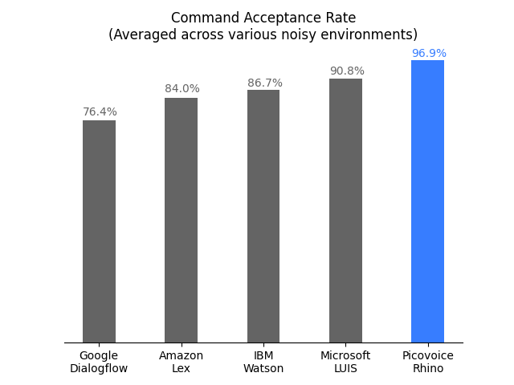

# Rhino

[](https://github.com/Picovoice/rhino/releases)

Made in Vancouver, Canada by [Picovoice](https://picovoice.ai)

Rhino is Picovoice's Speech-to-Intent engine. It directly infers intent from spoken commands within a given context of
interest, in real-time. For example, given a spoken command

>Can I have a small double-shot espresso?

Rhino infers that the user and emits the following inference result:

```json
{
  "isUnderstood": "true",
  "intent": "orderBeverage",
  "slots": {
    "beverage": "espresso",
    "size": "small",
    "numberOfShots": "2"
  }
}
```

Rhino is:

- using deep neural networks trained in real-world environments.
- compact and computationally-efficient. It is perfect for IoT.
- cross-platform. Raspberry Pi, BeagleBone, Android, iOS, Linux (x86_64), Mac (x86_64), Windows (x86_64), and web
browsers are supported. Additionally, enterprise customers have access to ARM Cortex-M SDK.
- self-service. Developers can train custom models using [Picovoice Console](https://picovoice.ai/console/).

## Table of Contents

- [Rhino](#rhino)
  - [Table of Contents](#table-of-contents)
  - [License & Terms](#license--terms)
  - [Use Cases](#use-cases)
  - [Try It Out](#try-it-out)
  - [Performance](#performance)
  - [Terminology](#terminology)
  - [Demos](#demos)
    - [Python](#python-demos)
    - [.NET](#net-demos)
    - [Java](#java-demos)
    - [React Native](#react-native-demos)
    - [Android](#android-demos)
    - [iOS](#ios-demos)
    - [JavaScript](#javascript-demos)
    - [NodeJS](#nodejs-demos)
    - [C](#c-demos)
  - [SDKs](#sdks)
    - [Python](#python)
    - [.NET](#net)
    - [Java](#java)
    - [React Native](#react-native)
    - [Android](#android)
    - [iOS](#ios)
    - [JavaScript](#javascript)
    - [NodeJS](#nodejs)
    - [C](#c)
  - [Releases](#releases)
  - [FAQ](#faq)

## License & Terms

Rhino SDK is free and licensed under Apache 2.0 including the [models](/resources/contexts) released within the
repository. [Picovoice Console](https://picovoice.ai/console/) offers two types of subscriptions: Personal and Enterprise.
Personal accounts can train custom wake word models, subject to limitations and strictly for non-commercial purposes.
Personal accounts empower researchers, hobbyists, and tinkerers to experiment. Enterprise accounts can unlock all
capabilities of Picovoice Console, are permitted for use in commercial settings, and have a path to graduate to
commercial distribution[<sup>*</sup>](https://picovoice.ai/pricing/).

## Use Cases

Rhino is the right product if the domain of voice interactions is specific (limited).

- If you want to create voice experiences similar to Alexa or Google, check out [Picovoice platform](https://github.com/Picovoice/picovoice).
- If you need to recognize a few static (always listening) voice commands, check out [Porcupine](https://github.com/Picovoice/porcupine).

## Try It Out

- [Interactive Web Demo](https://picovoice.ai/demos/barista/)

- Rhino and [Porcupine](https://github.com/Picovoice/porcupine) on an ARM Cortex-M7

[](https://www.youtube.com/watch?v=WadKhfLyqTQ)

## Performance

A comparison between the accuracy of Rhino and major cloud-based alternatives is provided
[here](https://github.com/Picovoice/speech-to-intent-benchmark). Below is the summary of the benchmark:



## Terminology

Rhino infers the user's intent from spoken commands within a domain of interest. We refer to such a specialized domain as
a `Context`. A context can be thought of a set of voice commands each mapped to an intent:

```yaml
turnLightOff:
  - Turn off the lights in the office
  - Turn off all lights
setLightColor:
  - Set the kitchen lights to blue
```

In examples above, each voice command is called an `Expression`. Expressions are what we expect the user to utter
to interact with our voice application.

Consider the expression

>Turn off the lights in the office
 
What we require from Rhino is:

1. To infer the intent (`turnLightOff`)
2. Record the specific details from the utterance, in this case the location (`office`)

We can capture these details using slots by updating the expression:

```yaml
turnLightOff:
  - Turn off the lights in the $location:lightLocation.
```

`$location:lightLocation` means that we expect a variable of type `location` to occur and we want to capture its value
in a variable named `lightLocation`. We call such variable a `Slot`. Slots give us the ability to capture details of the
spoken commands. Each slot type is be defined as a set of phrases. For example:

```yaml
lightLocation:
  - "attic"
  - "balcony"
  - "basement"
  - "bathroom"
  - "bedroom"
  - "entrance"
  - "kitchen"
  - "living room"
  - ...
```

You can create custom contexts using the [Picovoice Console](https://picovoice.ai/console/).

To learn the complete expression syntax of Rhino, see the [Speech-to-Intent Syntax Cheat Sheet](https://picovoice.ai/docs/syntax-cheat-sheet/).

## Demos

### Python Demos

Install [PyAudio](https://people.csail.mit.edu/hubert/pyaudio/) and then the demo package:

```bash
sudo pip3 install pvrhinodemo
```

With a working microphone connected to your device run the following in the terminal:

```
rhino_demo_mic --context_path ${CONTEXT_FILE_PATH}
```

Replace `${CONTEXT_FILE_PATH}` with either a context file created using Picovoice Console or one within the repository.

For more information about Python demos go to [demo/python](/demo/python).

### .NET Demos

[Rhino .NET demo](/demo/dotnet) is a command-line application that lets you choose between running Rhino on an audio
file or on real-time microphone input.

Make sure there is a working microphone connected to your device. From [demo/dotnet/RhinoDemo](/demo/dotnet/RhinoDemo)
run the following in the terminal:

```bash
dotnet run -c MicDemo.Release -- --context_path ${CONTEXT_FILE_PATH}
```

Replace `${CONTEXT_FILE_PATH}` with either a context file created using Picovoice Console or one within the repository.

For more information about .NET demos go to [demo/dotnet](/demo/dotnet).

### Java Demos

The [Rhino Java demo](/demo/java) is a command-line application that lets you choose between running Rhino on a
audio file or on real-time microphone input.

Make sure there is a working microphone connected to your device. From the root of the repository run the following in
the terminal:

```bash
java -jar demo/java/bin/rhino-mic-demo.jar -c ${CONTEXT_FILE_PATH}
```

Replace `${CONTEXT_FILE_PATH}` with either a context file created using Picovoice Console or one within the repository.

For more information about Java demos go to [demo/java](/demo/java).

### React Native Demos

To run the React Native Rhino demo app you'll first need to setup your React Native environment. For this, 
please refer to [React Native's documentation](https://reactnative.dev/docs/environment-setup). Once your environment has 
been set up, navigate to [demo/react-native](/demo/react-native) to run the following commands:

For Android: 
```sh
yarn android-install    # sets up environment
yarn android-run        # builds and deploys to Android
```

For iOS:

```sh
yarn ios-install        # sets up environment
yarn ios-run            # builds and deploys to iOS
```

### Android Demos

Using Android Studio, open [demo/android/Activity](/demo/android/Activity) as an Android project and then run the
application. After pressing the start button you can issue commands such as

>Turn off the lights.

or

>Set the lights in the living room to purple.

For more information about Android demo and the complete list of available expressions go to [demo/android](/demo/android).

### iOS Demos

Using [Xcode](https://developer.apple.com/xcode/), open
[demo/ios/RhinoDemo/RhinoDemo.xcodeproj](/demo/ios/RhinoDemo/RhinoDemo.xcodeproj) and run the application. After pressing
the start button you can issue commands such as

>Turn off the lights.

or

>Set the lights in the living room to purple.

For more information about Android demo and the complete list of available expressions go to [demo/ios/RhinoDemo](/demo/ios/RhinoDemo).

### JavaScript Demos

From [demo/javascript](/demo/javascript) run the following in the terminal:

```bash
yarn
yarn start
```

It will launch a local server running the demo. Open `http://localhost:5000` in your web browser and follow the
instructions on the page.

### NodeJS Demos

Install [node-record-lpcm16](https://www.npmjs.com/package/node-record-lpcm16) NPM package and follow the instructions
there for setting up your microphone. Then install the demo package:

```bash
yarn global add @picovoice/rhino-node-demo
```

With a working microphone connected to your device run the following in the terminal:

```shell
rhn-mic-demo --context_path ${CONTEXT_FILE_PATH}
```

Replace `${CONTEXT_FILE_PATH}` with either a context file created using Picovoice Console or one within the repository.

For more information about NodeJS demos go to [demo/nodejs](/demo/nodejs).

### C Demos

[Microphone demo](/demo/c/rhino_demo_mic.c) runs on Linux-based systems (e.g. Ubuntu, Raspberry Pi, and BeagleBone).
Build the demo:

```bash
gcc -std=c99 -O3 -o demo/c/rhino_demo_mic -I include demo/c/rhino_demo_mic.c -ldl -lasound
```

Find the name of audio input device (microphone) on your computer using `arecord -L` and then from the root of the
repository run the demo:

```bash
./demo/c/rhino_demo_mic \
${RHINO_LIBRARY_PATH} \
lib/common/rhino_params.pv \
resources/contexts/${SYSTEM}/smart_lighting_${SYSTEM}.rhn \
${INPUT_AUDIO_DEVICE}
```

Replace `${LIBRARY_PATH}` with path to appropriate library available under [lib](/lib), `${SYSTEM}` with the
name of the platform you are running on (`linux`, `raspberry-pi`, or `beaglebone`), and `${INPUT_AUDIO_DEVICE}` with
the name of your microphone device. The demo opens an audio stream and your intent from spoken commands in the context
of a smart lighting system. For example you can say

>Turn on the lights in the bedroom.

## SDKs

### Python

Install the Python SDK:

```bash
pip3 install pvrhino
```

The SDK exposes a factory method to create instances of the engine:

```python
import pvrhino
 
handle = pvrhino.create(context_path='/absolute/path/to/context')
```

Where `context_path` is the absolute path to Speech-to-Intent context created either using Picovoice Console or one of
the default contexts available on Rhino's GitHub repository.

When initialized, valid sample rate can be obtained using `rhino.sample_rate`. Expected frame length
(number of audio samples in an input array) is `rhino.frame_length`. The object can be used to infer intent from spoken
commands as below:

```python
import pvrhino
 
handle = pvrhino.create(context_path='/absolute/path/to/context')

def get_next_audio_frame():
    pass

while True:
    is_finalized = handle.process(get_next_audio_frame())

    if is_finalized:
        inference = handle.get_inference()
        if not inference.is_understood:
            # add code to handle unsupported commands
            pass
        else:
            intent = inference.intent
            slots = inference.slots
            # add code to take action based on inferred intent and slot values
```

Finally, when done be sure to explicitly release the resources using `handle.delete()`.

### .NET

Install the .NET SDK using Nuget or the dotnet CLI

```bash
dotnet add package Rhino
```

The SDK exposes a factory method to create instances of the engine as below:

```csharp
using Pv

Rhino handle = Rhino.Create(contextPath:"/absolute/path/to/context");
```

When initialized, the valid sample rate is given by `handle.SampleRate`. Expected frame length (number of audio samples
in an input array) is `handle.FrameLength`. The engine accepts 16-bit linearly-encoded PCM and operates on
single-channel audio.

```csharp
short[] GetNextAudioFrame()
{
    // .. get audioFrame
    return audioFrame;
}

while(true)
{
    bool isFinalized = handle.Process(GetNextAudioFrame());
    if(isFinalized)
    {
        Inference inference = handle.GetInference();
        if(inference.IsUnderstood)
        {
            string intent = inference.Intent;
            Dictionary<string, string> slots = inference.Slots;
            // .. code to take action based on inferred intent and slot values
        }
        else
        {
            // .. code to handle unsupported commands
        }
    }
}
```

Rhino will have its resources freed by the garbage collector, but to have resources freed
immediately after use, wrap it in a using statement:

```csharp
using(Rhino handle = Rhino.Create(contextPath:"/absolute/path/to/context"))
{
    // .. Rhino usage here
}
```

### Java

You can install the Rhino Java SDK by downloading and referencing the latest [Rhino JAR file](/binding/java/bin).

The SDK exposes a Builder that allows you to create an instance of the engine:

```java
import ai.picovoice.rhino.*;

try{
    Rhino handle = new Rhino.Builder()
                    .setContextPath("/absolute/path/to/context")
                    .build();
} catch (RhinoException e) { }
```

When initialized, the valid sample rate is given by `handle.getSampleRate()`. Expected frame length (number of audio samples
in an input array) is `handle.getFrameLength()`. The engine accepts 16-bit linearly-encoded PCM and operates on
single-channel audio.

```java
short[] getNextAudioFrame(){
    // .. get audioFrame
    return audioFrame;
}

while(true) {
    boolean isFinalized = handle.process(getNextAudioFrame());
    if(isFinalized){
        RhinoInference inference = handle.getInference();
        if(inference.getIsUnderstood()){
            String intent = inference.getIntent();
            Map<string, string> slots = inference.getSlots();
            // .. code to take action based on inferred intent and slot values
        } else {
            // .. code to handle unsupported commands
        }
    }
}
```

Once you're done with Rhino, ensure you release its resources explicitly:

```java
handle.delete();
```

### React Native

Install  [@picovoice/react-native-voice-processor](https://www.npmjs.com/package/@picovoice/react-native-voice-processor) and 
[@picovoice/rhino-react-native](https://www.npmjs.com/package/@picovoice/rhino-react-native). The SDK provides two APIs: 

#### High-Level API

[RhinoManager](/binding/react-native/src/rhinomanager.tsx) provides a high-level API that takes care of
audio recording. This class is the quickest way to get started.

The constructor `RhinoManager.create` will create an instance of a RhinoManager using a context file that you pass to it.
```javascript
async createRhinoManager(){
    try{
        this._rhinoManager = await RhinoManager.create(
            '/path/to/context/file.rhn',
            inferenceCallback);
    } catch (err) {
        // handle error
    }
}
```

Once you have instantiated a RhinoManager, you can start/stop audio capture and wake word detection by calling `.process()`.
Upon receiving an inference callback, audio capture will stop automatically and Rhino will reset. To restart it you must 
call `.process()` again.

```javascript
let didStart = await this._rhinoManager.process();
```

When you are done using Rhino, release you must explicitly resources:
```javascript
this._rhinoManager.delete();
```

[@picovoice/react-native-voice-processor](https://github.com/Picovoice/react-native-voice-processor/) handles 
audio capture and RhinoManager passes frames to the inference engine for you.

#### Low-Level API

[Rhino](/binding/react-native/src/rhino.tsx) provides low-level access to the inference engine for those
who want to incorporate speech-to-intent into a already existing audio processing pipeline.

`Rhino` is created by passing a context file to its static constructor `create`:

```javascript
async createRhino(){
    try{
        this._rhino = await Rhino.create('/path/to/context/file.rhn');
    } catch (err) {
        // handle error
    }
}
```
As you can see, in this case you don't pass in an inference callback as you will be passing in audio frames directly 
using the `process` function. The JSON result that is returned from `process` will have up to four fields:
- isFinalized - whether Rhino has made an inference
- isUnderstood - if isFinalized, whether Rhino understood what it heard based on the context
- intent - if isUnderstood, name of intent that were inferred
- slots - if isUnderstood, dictionary of slot keys and values that were inferred

```javascript
let buffer = getAudioFrame();
try {
    let result = await this._rhino.process(buffer);    
    // use result
    // ..        
    }
} catch (e) {
    // handle error
}

// once you're done
this._rhino.delete();
```

### Android

There are two possibilities for integrating Rhino into an Android application.

#### High-Level API

[RhinoManager](binding/android/Rhino/rhino/src/main/java/ai/picovoice/rhino/RhinoManager.java) provides a high-level API
for integrating Rhino into Android applications. It manages all activities related to creating an input audio stream,
feeding it into Rhino, and invoking a user-provided inference callback.

```java
    final String modelPath = ... // Available at lib/common/rhino_params.pv
    final String contextPath = ...
    final float sensitivity = 0.5;

RhinoManager manager = new RhinoManager(
        modelPath,
        contextPath,
        sensitivity,
        new RhinoManagerCallback() {
            @Override
            public void invoke(RhinoInference inference) {
                // Insert infernce event logic
            }
        });
```

Sensitivity is the parameter that enables developers to trade miss rate for false alarm. It is a floating number within
[0, 1]. A higher sensitivity reduces miss rate at cost of increased false alarm rate.

When initialized, input audio can be processed using `manager.process()`. When done be sure to release the resources
using `manager.delete()`.

#### Low-Level API

Rhino provides a binding for Android using JNI. It can be initialized using:

```java
final String modelPath = ... // Available at lib/common/rhino_params.pv
final String contextPath = ...
final float sensitivity = 0.5;

Rhino handle = new Rhino(modelPath, contextPath, sensitivity);
```

Once initialized, `handle` can be used for intent inference:

```java
private short[] getNextAudioFrame();

while (!handle.process(getNextAudioFrame()));

final RhinoInference inference = handle.getInference();
if (inference.getIsUnderstood()) {
    // logic to perform an action given the intent object.
} else {
    // logic for handling out of context or unrecognized command
}
```

Finally, prior to exiting the application be sure to release resources acquired via:

```java
handle.delete()
```

### iOS

There are two approaches for integrating Rhino into an iOS application.

#### High-Level API

The [RhinoManager](binding/ios/RhinoManager.swift) class manages all activities related to creating an input audio stream
feeding it into Rhino's library, and invoking a user-provided detection callback. The class can be initialized as below

```swift
let modelPath: String = ... // It is available at lib/common/rhino_params.pv
let contextPath: String = ...
let onInferenceCallback: ((Inference) -> Void) = { inference in
    // detection event callback
}

let manager = RhinoManager(
    modelPath: modelPath,
    contextPath: contextPath,
    onInferenceCallback: onInferenceCallback);
```

when initialized, input audio can be processed using `manager.process()`.

#### Direct

Rhino is shipped as a precompiled ANSI C library and can directly be used in Swift using module maps. It can be
initialized to detect multiple wake words concurrently using:

```swift
let modelPath: String = ... // Available at lib/common/rhino_params.pv
let contextPath: String = "/path/to/context/file.rhn"
let sensitivity: Float32 = 0.35

var handle: OpaquePointer?
let status = pv_rhino_init(
    modelPath,
    contextPath,
    sensitivity,
    &handle)
if status != PV_STATUS_SUCCESS {
    // error handling logic
}
```

Then `handle` can be used to process incoming audio stream.

```swift
func getNextAudioFrame() -> UnsafeMutablePointer<Int16> {
    //
}

while true {
    let pcm = getNextAudioFrame()

    var isFinalized: Bool = false
    let status = pv_rhino_process(handle, pcm, &isFinalized)
    if status != PV_STATUS_SUCCESS {
        // error handling logic
    }

    if isFinalized {
        var isUnderstood: Bool = false
        var intent = ""
        var slots = [String: String]()
                
        status = pv_rhino_is_understood(handle, &isUnderstood)
        if status != PV_STATUS_SUCCESS {
            // error handling logic
        }    

        if isUnderstood {
            var cIntent: UnsafePointer<Int8>?
            var numSlots: Int32 = 0
            var cSlotKeys: UnsafeMutablePointer<UnsafePointer<Int8>?>?
            var cSlotValues: UnsafeMutablePointer<UnsafePointer<Int8>?>?
            status = pv_rhino_get_intent(
                handle,
                &cIntent,
                &numSlots,
                &cSlotKeys,
                &cSlotValues)
            if status != PV_STATUS_SUCCESS {
                // error handling logic
            }
            
            if isUnderstood {
                intent = String(cString: cIntent!)
                for i in 0...(numSlots - 1) {
                    let slot = String(cString: cSlotKeys!.advanced(by: Int(i)).pointee!)
                    let value = String(cString: cSlotValues!.advanced(by: Int(i)).pointee!)
                    slots[slot] = value
                }
                
                // Insert inference logic

                status = pv_rhino_free_slots_and_values(handle, cSlotKeys, cSlotValues)
                if status != PV_STATUS_SUCCESS {
                    // error handling logic
                }
            } else {
                // Insert logic for invalid commands
            }
        }
        
        pv_rhino_reset(handle)
    }
}
```

When finished, release the resources via

```swift
pv_rhino_delete(handle)
```

### JavaScript

Create a new instance of engine using

```javascript
let context = new Uint8Array([...]);

let handle = Rhino.create(context)
```

`context` is an array of 8-bit unsigned integers (i.e. `UInt8Array`) representing the domain of interest. When
instantiated `handle` can process audio via its `.process` method.

```javascript
    let getNextAudioFrame = function() {
        ...
    };

    let result = {};
    do {
        result = handle.process(getNextAudioFrame())
    } while (Object.keys(result).length === 0);

    if (result.isUnderstood) {
        // callback to act upon inference result
    } else {
        // callback to handle failed inference
    }
```

When done be sure to release resources acquired by WebAssembly using `.release`.

```javascript
handle.release();
```

### NodeJS

Install NodeJS SDK:

```bash
yarn add @picovoice/rhino-node
```

Create instances of the Rhino class by specifying the path to the context file:

```javascript
const Rhino = require("@picovoice/rhino-node");


let handle = new Rhino("/path/to/context/file.rhn");
```

When instantiated, `handle` can process audio via its `.process` method.

```javascript
let getNextAudioFrame = function() {
    ...
};

let isFinalized = false;
while (!isFinalized) {
  isFinalized = handle.process(getNextAudioFrame());
  if (isFinalized) {
    let inference = engineInstance.getInference();
    // Insert inference event callback
  }
}
```

When done be sure to release resources acquired by WebAssembly using `release()`:

```javascript
handle.release();
```

### C

Rhino is implemented in ANSI C and therefore can be directly linked to C applications. The [pv_rhino.h](/include/pv_rhino.h)
header file contains relevant information. An instance of the Rhino object can be constructed as follows.

```c
const char *model_path = ... // Available at lib/common/rhino_params.pv
const char *context_path = ... // absolute path to context file for the domain of interest
const float sensitivity = 0.5f;

pv_rhino_t *handle = NULL;
const pv_status_t status = pv_rhino_init(model_path, context_path, sensitivity, &handle);
if (status != PV_STATUS_SUCCESS) {
    // add error handling code
}
```

Now the `handle` can be used to infer intent from an incoming audio stream. Rhino accepts single channel, 16-bit PCM
audio. The sample rate can be retrieved using `pv_sample_rate()`. Finally, Rhino accepts input audio in consecutive chunks
(frames); the length of each frame can be retrieved using `pv_rhino_frame_length()`.

```c
extern const int16_t *get_next_audio_frame(void);

while (true) {
    const int16_t *pcm = get_next_audio_frame();

    bool is_finalized = false;
    pv_status_t status = pv_rhino_process(handle, pcm, &is_finalized);
    if (status != PV_STATUS_SUCCESS) {
        // add error handling code
    }

    if (is_finalized) {
        bool is_understood = false;
        status = pv_rhino_is_understood(rhino, &is_understood);
        if (status != PV_STATUS_SUCCESS) {
            // add error handling code
        }

        if (is_understood) {
            const char *intent = NULL;
            int32_t num_slots = 0;
            const char **slots = NULL;
            const char **values = NULL;
            status = pv_rhino_get_intent(rhino, &intent, &num_slots, &slots, &values);
            if (status != PV_STATUS_SUCCESS) {
                // add error handling code
            }

            // add code to take action based on inferred intent and slot values

            pv_rhino_free_slots_and_values(rhino, slots, values);
        } else {
            // add code to handle unsupported commands
        }

        pv_rhino_reset(rhino);
    }
}
```

When done, remember to release the resources acquired.

```c
pv_rhino_delete(rhino);
```

## Releases

### v1.6.0 December 2nd, 2020

- Added support for React Native.
- Added support for Java.
- Added support for .NET.
- Added support for NodeJS.

### v1.5.0 June 4th, 2020

- Accuracy improvements.

### v1.4.0 April 13th, 2020

- Accuracy improvements.
- Builtin slots

### v1.3.0 February 13th, 2020

- Accuracy improvements.
- Runtime optimizations.
- Added support for Raspberry Pi 4
- Added support for JavaScript.
- Added support for iOS.
- Updated documentation.

### v1.2.0 April 26, 2019

- Accuracy improvements.
- Runtime optimizations.

### v1.1.0 December 23rd, 2018

- Accuracy improvements.
- Open-sourced Raspberry Pi build.

### v1.0.0 November 2nd, 2018

- Initial Release

## FAQ

You can find the FAQ [here](https://picovoice.ai/docs/faq/rhino/).
